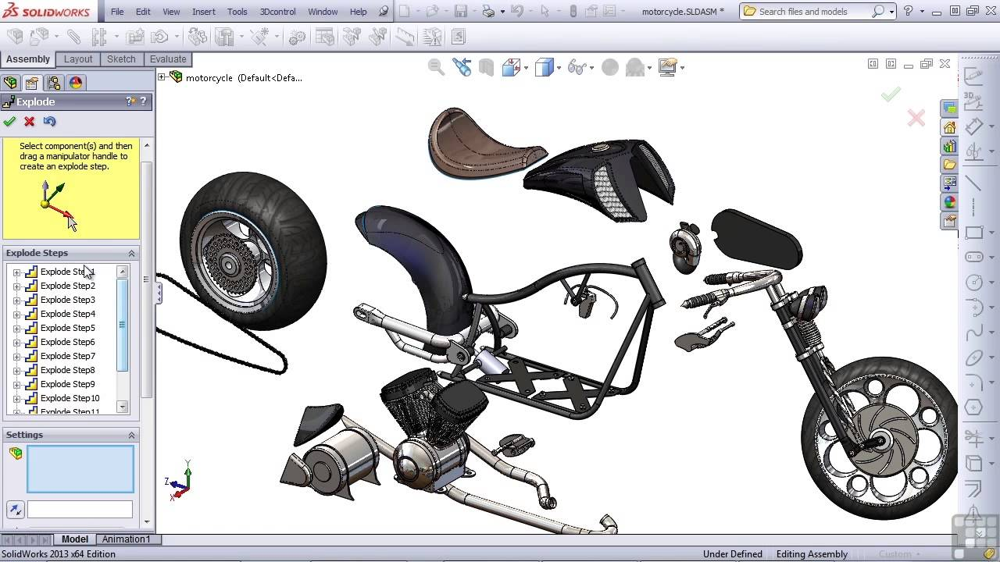

[.lightbg,background-image="images/sit-on-hands.jpg", background-opacity="1.0"]
== Think before ...

[.lightbg,background-image="images/sit-on-hands.jpg", background-opacity="0.6"]
=== Think first

* Too often, [blue]#experienced# developers 'see' the solution +
 [red]#before# they hear the end of the requirements.
** They think in solutions, and often fail to understand +
  the real problem and miss the better solution.

[.notes]
--
Even if the solution is not the answer to the problem, or even the best.
--

[.lightbg,background-image="images/sit-on-hands.jpg", background-opacity="0.6"]
=== Deeper analysis

* Can you find analogies?
* Twist and turn the concept model, it may reveal other approaches.
* A model is a `perspective`.

[.lightbg,background-image="images/sit-on-hands.jpg", background-opacity="0.6"]
=== Model (analyze) this

image::images/Exploded-view-of-the-differential-assembly.png[]

[.lightbg,background-image="images/sit-on-hands.jpg", background-opacity="0.6"]
=== [.small-font]#Model this too#

[.lightbg,background-image="images/sit-on-hands.jpg", background-opacity="0.6"]
=== Modeling/analysing is...

...Finding the proper perspective.

* A typical physical artifact can be modeled as a
* A tree of sub assemblies, where each sub-assembly +
  is a list of sub-assemblies.
* There is a (GoF) pattern here.

[.notes]
--
* In all the above the first models are list and tree, and as a matter of fact
 tree plus list is the most useful.
* Composite is the patterns
* If we have a tree in which each node can have a list of nodes, than with an average
of 7 children per node an three levels deep, we can express an assembly of 343 parts.
* Rules need to be made to assign sub-assemblies to levels.
* The top level is the whole.
* For each assembly, it can be considered as a whole and can be built independent of the other assemblies on the same level.
* No cycles in the loop.
* Leaf nodes may refer to the same type (think nuts and bolts, spokes of a wheel)
--
