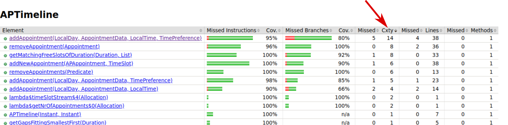
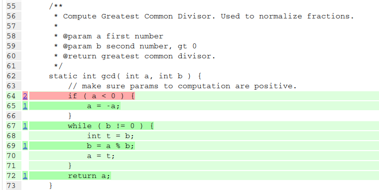

[.decentlightbg,background-video="videos/flowers.mp4",background-video-loop="true",background-opacity="0.6"]
== Test Quiz

[.notes]
--
* Who uses and agile process?
* What is your definition of done?
* How do you measure burn down?
* What do you want to achieve with +
'system or software architecture'?
--

[.decentlightbg,background-video="videos/flowers.mp4",background-video-loop="true",background-opacity="0.6"]
=== Reasons to test

* Testing is not a [red]*cost* but an [green]*investment*.
* By working TDD style you typically write [green]#less# code.
* Writing tests can help [green]#reveal inconsistencies# in requirements.
* You [green]#reduce risk# in the future.
* Having [red]#too few# tests produces a serious [red]#technical debt#.

[.notes]
--
* Studies have shown that, after some decrease at the beginning, +
  testing actually increases programmers productivity.
* In coding, _less is more_.
* Automated tests and regressions.
* If your company is also hired for maintenance, the investment will pay out double.
* Testing makes code more easily transferable.
--

[.decentlightbg,background-video="videos/fog-hands.mp4",background-video-loop="true",background-opacity="0.6"]
=== No Tests, No Progress

* You can't measure progress [green]#unless# you test.
* A test ensures that a feature is realized.

[.notes]
--
Although tests can't prove the absence of errors,
they can help measure the degree of done.
--

[.decentlightbg,background-video="videos/flowers.mp4",background-video-loop="true",background-opacity="0.6"]
=== Test types

* Unit versus integration
* Static versus dynamic

[.notes]
--
* The compiler is your first line of defense: static test.
* Reviewing (with experienced reviewers) is a static test and can be very valuable.
** Experienced reviewers (those that have made or seen lots of errors) can spot weakness easily.
* Running test means dynamic test, either unit or integration
--

[.decentlightbg,background-video="videos/flowers.mp4",background-video-loop="true",background-opacity="0.6"]
=== Economics of testing

* Unit Test should be fast for immediate feedback to the developer.
* Breaking down a larger project into smaller sub projects +
  can help improve coverage.
** Layer model helps.
* You do not test your library in the application, you assume it tested.
* For later: generated code needs no tests.
** However: The generators do.

[.notes]
--
* Ideally be able to run a single method.
* If those sub projects adhere to TDD.
* But think: a generator can generate 1000 classes, or DTO and mappers.
--

[.decentlightbg,background-video="videos/flowers.mp4",background-video-loop="true",background-opacity="0.6"]
=== Tests give confidence

* Including confidence to change or experiment.

[.notes]
--
* a set of passing functional tests are a great way to enable experiments
  to improve non functional aspects such as efficiency, readability.
--

[.decentlightbg,background-video="videos/flowers.mp4",background-video-loop="true",background-opacity="0.6"]
=== Testing Documents

* A well written test is the easiest way to document [blue]*how* an API +
 is to be used, including [red]*pre*- and post-conditions.
* Write your code examples as tests will nudge towards more testing.

[.notes]
--
* Tests are an excellent way to document the use of an API.
* A (unit) test can help express the intention of the (original) developer.
--

[.decentlightbg,background-video="videos/flowers.mp4",background-video-loop="true",background-opacity="0.6"]
[.degrade,transition="convex-in"]
=== Example

[source,java]
----
  String greet= greeter.greet( "Klaas" );
  assertThat(greet) // passes iff
      .isNotNull() // prevents NPE down the chain
      .isNotEmpty() // not really needed
      .contains( "Hello", "Klaas" );
----
https://assertj.github.io/doc/[AssertJ ^]

[.notes]
--
* Apply the same rules to tests as to normal code, like style, readability.
* Using a modern test framework (e.g. AssertJ) helps creating *readable* tests.
* The test is trivial to write and exposes the function of the API.
* Example uses more asserts than needed, but is about readability.
--

[.decentlightbg,background-video="videos/flowers.mp4",background-video-loop="true",background-opacity="0.6"]
[.degrade,transition="concave-in"]
=== Example error handling

[source,java]
----
  ThrowingCallable code = () -> {
          greeter.greet( null ) );  // illegal use
  };

  // because it throws an NPE
  assertThrownBy( code )
     .isInstanceOf( NullPointerException.class )
     .hasMessageContaining( "not allowed" );
----
https://assertj.github.io/doc/[AssertJ ^]

[.notes]
--
* This test documents the precondition.
--

[.decentlightbg,background-video="videos/flowers.mp4",background-video-loop="true",background-opacity="0.6"]
=== Other AssertJ examples

[source,java]
----
    assertThat(fellowshipOfTheRing)
       .filteredOn(character -> character.getName().contains("o"))
       .containsOnly(aragorn, frodo, legolas, boromir)
       .extracting(character -> character.getRace().getName())
       .contains("Hobbit", "Elf", "Man");

----

From https://assertj.github.io/doc/#assertj-core[AssertJ-core doc ^]

[.decentlightbg,background-video="videos/flowers.mp4",background-video-loop="true",background-opacity="0.6"]
=== Use Parameterized tests

* Read test data from csv files or parameter lists
* Makes writing less test

[.decentlightbg,background-video="videos/flowers.mp4",background-video-loop="true",background-opacity="0.6"]
=== [.small-font]#parameterized test#

[source,java]
----
    @ParameterizedTest
    @CsvSource( {
      // msg, expected, n, d
        "whole number, 2, 2, 1 ",
        "two thirds, (2/3), 2, 3",
        "one third, (1/3), -3, -9 ",
        "minus two fifths, -(2/5), 12, -30",
        "one + two fifths, -(1+(2/5)), 35, -25 "
    } )
    void t2fractionToString( String message, String expected,
                             int num, int denom ) {

        Fraction actual = new Fraction( num, denom );
        assertThat( actual.toString() )
                .as( message )
                .isEqualTo( expected );

    }
----

[.decentlightbg,background-video="videos/flowers.mp4",background-video-loop="true",background-opacity="0.6"]
=== Use test measurement tooling

* Code coverage includes a view on complexity.
* Business code mutation or automatic breaking the code +
  to check the tests.

[.notes]
--
* explain McCabe's cyclomatic complexity?
** Number of independent linear paths through the code.
* show examples from Alda?
* Pitests shows how good your tests are at discovering errors.
--

[.decentlightbg,background-video="videos/flowers.mp4",background-video-loop="true",background-opacity="0.6",hidden]
=== Coverage and [green]*complexity*

[.decentlightbg,background-video="videos/flowers.mp4",background-video-loop="true",background-opacity="0.6"]
[%notitle]
=== No

image::images/addAppointment.png[height=800px]

[.decentlightbg,background-video="videos/flowers.mp4",background-video-loop="true",background-opacity="0.6"]
=== [.small-font]#Lessons from test tooling#

* [red]#Coverage# is not the ultimate goal, [green]*less complexity* is.
* Looking at coverage reports +
 and wonder [blue]#why you can't reach a branch#.
* Not covered code points out [red]#too much code#, +
  as in code that is not required via TDD, or to few tests. +
 (Add a data record?)

[.notes]
--
* _Unreachable code_ (by precondition in earlier parts) is a side effect of high complexity.
Studying the coverage report (which branch is never reached) may help find a test, or, more often,
a too complex solution or branching logic in the wrong order or over constrained.
* Even if you do not care so much about high coverage, *do* look at the complexity of methods, and see if you can
improved (decrease) complexity.
* Starting with one test data record and then add a test record to cover more is an efficient approach.
--

[.decentlightbg,background-video="videos/flowers.mp4",background-video-loop="true",background-opacity="0.6"]
=== Lessons from code mutation

* You may find missed potential bugs, even if code coverage says 100 %.
* Sometimes you get false positives. +
 Best is to comment them, for the maintainer.

[.decentlightbg,background-video="videos/flowers.mp4",background-video-loop="true",background-opacity="0.6"]
=== General observations

* Code of 'experienced' juniors is often complex.
* This complexity is often a sign of NOT working TDD.
* The least complex code always wins, +
  is more understandable and maintainable.
* Demo false positives with fraction

[.notes]
--
* Student specific?
--

[.decentlightbg,background-video="videos/flowers.mp4",background-video-loop="true",background-opacity="0.6"]
=== Pitest false positive

* message is: changed boundary survived, +
 because in this case *less than* and *less or equal*  are idempotent.
